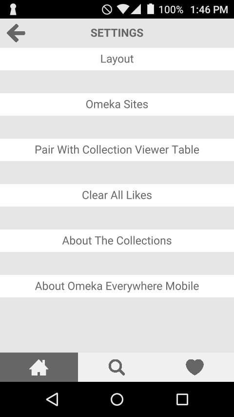

## Adding new sites
In order for an Omeka Classic site to be able to serve content to the mobile app, it must have the [API enabled](http://omeka.org/classic/docs/Admin/Settings/API_Settings/).

To add content from the Omeka Classic site to the app: 

1. Open the app on a mobile device
2. Click on the gear icon to open the Settings page.
3. From the Settings page, click the Omeka Sites option.
4. Using the field toward the bottom of the screen, enter the url of the Omeka site (the base url, without `/api` at the end). When you are typing, the text will display in red until you have a valid url, at which point it will turn green. 

## Using the Omeka Everywhere App
This information below is provided so that it can be copied, modified as needed, and distributed to your visitors and/or your front line staff to assist them with using the distributed version of the Omeka Everywhere Mobile Viewer.

### Instructions for Using the App
When you open the app you'll see items from the collection, exhibit, or specific group. 

#### Home Screen (house)

Quickly likes an item by click on the heart outline button over its thumbnail image. Items you have liked will have a filled in heart. 

**Item Page**

Click on the thumbnail to see a larger image and read more about the item.

On an item's individual page you can:
- read more about the item;
- click the ellipses (three dot) button to share the item;
- click the heart button to add the item to your likes;
- click the expand button in the upper right corner of the image to see a larger version.

**Filter (magnifying glass) **

Click on the magnifying glass button in the bottom of the app to filter the items on display by theme or keyword. If you have liked items from more than one Omeka Everywhere installation, you will also be able to filter by source collection.

**Likes (heart)**

Click the heart to see your likes items. Unlikes an item by clicking on the heart button on its thumbnail.

#### Settings (gear icon)

From the Home screen you can access settings for the app:

**Layout** This allows you to set whether the items on the home and likes screens appear in a list view with image and title, or a grid of images.

**Omeka Sites** Add new Omeka site content to your app by entering the url in the "Add new site" section or by scanning a QR code. 

You can also manage the sites you have loaded. Press and hold a site to remove it from the list; be aware that there must be one site loaded at all times.

**Pair with Collection Viewer Table** If you are in an exhibit or gallery with an Omeka Everywhere Connection Viewer Table, you can pair your mobile with the table and save items from the table to the app.

**Clear All Likes** When you tap on this bar, you will have the option to click again to delete all your current likes in the app. This action is not reversible. 

**About the Collections** Click through for more information on the featured collection.

**About Omeka and Open Exhibits** Learn more about the team behind Omeka Everywhere.

